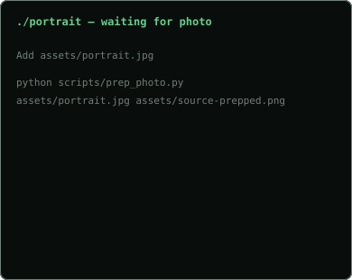

<div align="center">

# `YOUR_NAME`

### `Full Stack Developer`

[](https://github.com/YOUR_GITHUB_USERNAME)
[](https://example.com)

</div>

<p align="center"></p>

<table><tr><td valign="top" width="42%"></td><td valign="top"></td></tr></table>

---

## `~/projects`

| Project | Description |
|---|---|
| **[Pole Apex](https://www.poleapex.com)** | F1 league management SaaS |
| **Holy Earth** | Interactive 3D faith world |
| **Lulelu** | Digital commerce platform |

## `~/stack`

```text
Frontend     React · React Native · TypeScript
Backend      Node.js · Express
Data         PostgreSQL · Redis
3D           Three.js · Blender
Infrastructure Docker · Linux · Cloudflare · Vercel
```

## `~/about`

I build web applications, developer tools, SaaS products and interactive 3D experiences.

<p align="center">`$ echo "keep building."`</p>
