  

  
  
  
  

  

  

## Projects

| Project | What it is |
|---|---|
| **[Pole Apex](https://www.poleapex.com)** | F1 league management SaaS |
| **Holy Earth** | Interactive 3D faith world |
| **[Lulelu](https://lulelu.store)** | Digital commerce platform |

## Stack

`React` · `React Native` · `TypeScript` · `Node.js` · `Express` · `PostgreSQL` · `Redis` · `Three.js` · `Blender`

`Docker` · `Linux` · `Cloudflare` · `Vercel`
